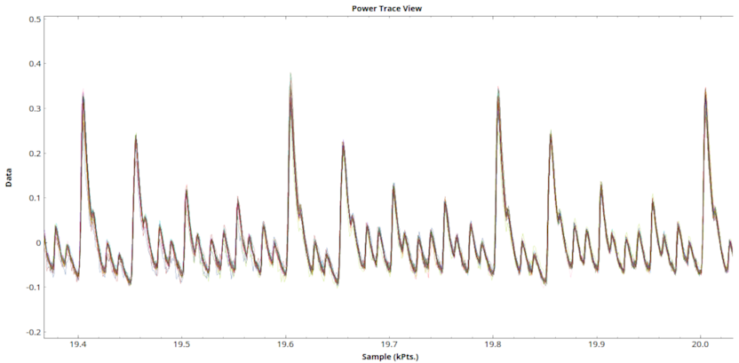
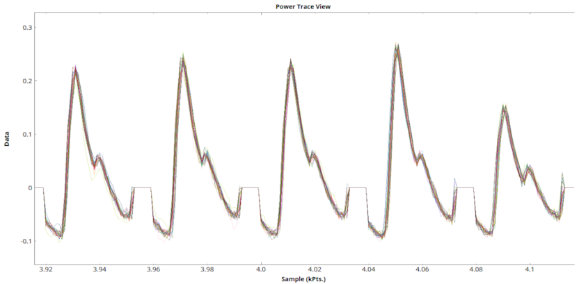
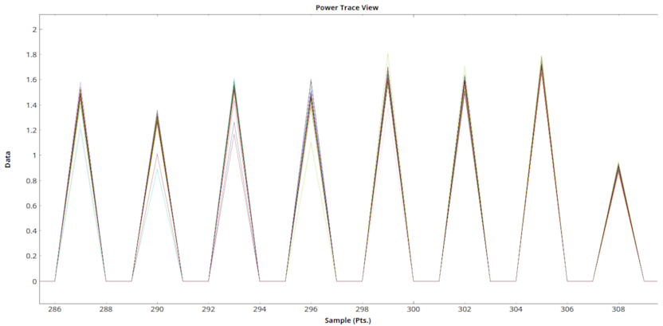
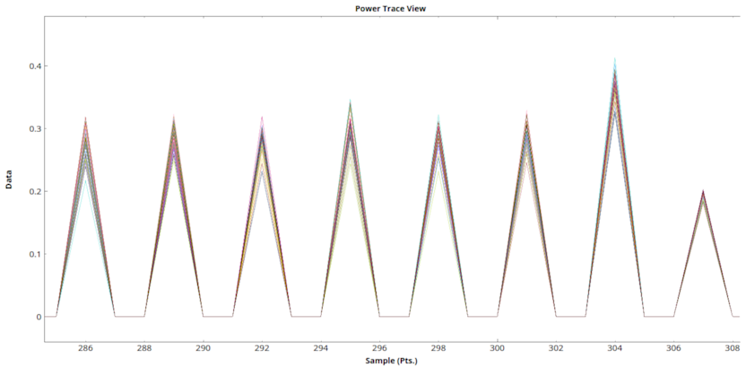

<meta charset="UTF-8">

Keeloq example traces: HCS301
=============================

This collection of traces is part of the [Keeloq toolset](../keeloq.md)
and complements the tutorials.  It can also be used as starting point
for new studies.

______________________________________________________________________

HCS301 raw
----------

Useful to study trace preparation and synchronization.

Captured with the ChipWhisperer CW1002 hardware kit using a GND shunt.
The chip is the SOIC-8 variant.

  - \> 500 semi-consecutive¹ messages
  - 48.2 MHz sample rate (approx 200 samples per cipher round)
  - Contains synchronization issues (RC oscillator clock drift)
  - Covers last 100 rounds (approx)
  - Ciphertext annotated
  - Full RF messages included in a log file

Download     [HCS301 raw](HCS301_raw.zip)

**TODO**: add screenshot

_________________________________________________________________________

HCS301 sync
-----------

Useful to study any aspect of the power behavior.

Derived from **HCS301 raw**, with clock drift compensated and freaks
removed.

  - 501 semi-consecutive¹ messages
  - 200 samples per cipher round

**TODO**: specify how many rounds are covered

Download     [HCS301 sync](HCS301_sync.zip):

  - Round 528 (position) = 20000
  - Round width (samples) = 200

_________________________________________________________________________

HCS301 bits (full / peak)
-------------------------

Useful to study bit model attacks.

Derived from **HCS301 sync**, trimmed to just the point range where
MSB/LSB bit values leak.  Each round is zero-padded for visual
guidance.

Download     [HCS301 bits full](HCS301_bits_full.zip):

  - Round 528 (position) = 4000
  - Round width (samples) = 40

Download     [HCS301 bits peak](HCS301_bits_peak.zip):

  - Round 528 (position) = 301
  - Round width (samples) = 3

_________________________________________________________________________

HCS301 shift (full / peak)
-------------------------

Useful to study Hamming distance attacks.

Derived from **HCS301 sync**, trimmed to just the point range where the
status register leaks.  Each round is zero-padded for visual guidance.

**TODO**: add HCS301 shift full

Download     [HCS301 shift peak](HCS301_shift_peak.zip):

  - Round 528 (position) = 306
  - Round width (samples) = 3

_________________________________________________________________________

Notes:
------

¹ semi-consecutive:

  > Only every other generated message was captured, and some of them
    were discarded afterwards.  All messages are from the same device,
    the internal counter is increasing, the step size is small, but it
    is not 1.

_________________________________________________________________________

_Document author: marc_ -
_Document version: 13-Oct-2016_ -
[Fork README](../../../../README.md) -
[Keeloq README](../keeloq.md)

